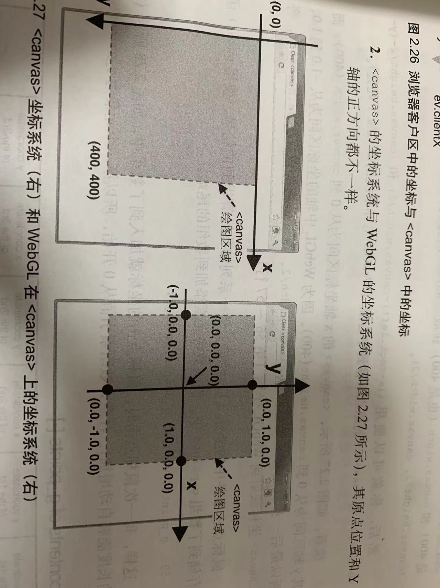

# webGL入门

## WebGLRenderingContext
WebGLRenderingContext 接口提供基于 OpenGL ES 2.0 的绘图上下文，用于在 HTML <canvas> 元素内绘图。
要获得这个接口的对象以用于 2D 和 3D 的图形渲染，可以通过在 <canvas> 元素上调用 getContext() 函数，调用时传入“webgl”参数：
```js
const canvas = document.getElementById('myCanvas');
const gl = canvas.getContext('webgl');
```
当你获取到 canvas 元素的 WebGL 绘图上下文，你便可以在里面绘图。

### 方法

#### WebGLRenderingContext.clearColor()
WebGL API 的 WebGLRenderingContext.clearColor() 方法用于设置清空颜色缓冲时的颜色值。
这指定调用 clear() 方法时使用的颜色值。这些值在 0 到 1 的范围间。

```js
/**
 * red 一个 GLclampf (en-US) 类型的值，指定清除缓冲时的红色值。默认值：0。
 * green 一个 GLclampf (en-US) 类型的值，指定清除缓冲时的绿色值。默认值：0。
 * blue 一个 GLclampf (en-US) 类型的值，指定清除缓冲时的蓝色值。默认值：0。
 * alpha 一个 GLclampf (en-US) 类型的值，指定清除缓冲时的不透明度。默认值：0。
 */
void gl.clearColor(red, green, blue, alpha);
```

一旦背景颜色被设置后，将会常驻WebGL系统中，在下一次调用gl.clearColor()之前都不会改变。

#### WebGLRenderingContext.clear()
WebGL API 的 WebGLRenderingContext.clear() 方法使用预设值来清空缓冲。
预设值可以使用 clearColor() 、 clearDepth() 或 clearStencil() (en-US) 设置。
裁剪、抖动处理和缓冲写入遮罩会影响 clear() 方法。

```js
/**
 * mask: 一个用于指定需要清除的缓冲区的 GLbitfield (en-US) 。可能的值有：

gl.COLOR_BUFFER_BIT //颜色缓冲区
gl.DEPTH_BUFFER_BIT //深度缓冲区
gl.STENCIL_BUFFER_BIT //模板缓冲区
 */
void gl.clear(mask);
```

#### WebGLRenderingContext.drawArrays()
方法用于从向量数组中绘制图元。

```js

/**
mode
GLenum (en-US) 类型，指定绘制图元的方式，可能值如下。
gl.POINTS: 绘制一系列点。
gl.LINE_STRIP: 绘制一个线条。即，绘制一系列线段，上一点连接下一点。第一个点是第一条线段的起点，第二个点是第一条线段的终点和第二条线段的起点，第i个点是第i-1个点的终点和第i个点线段的起点，最后一个点是最后一条线段的终点
gl.LINE_LOOP: 绘制一个线圈。即，绘制一系列线段，上一点连接下一点，并且最后一点与第一个点相连。
gl.LINES: 绘制一系列单独线段。每两个点作为端点，线段之间不连接。如果点的个数是奇数，最后一个点将被忽略
gl.TRIANGLE_STRIP：绘制一个三角带。前3个点构成第一个三角形从第2个点开始的三个点构成第2个三角形（这个三角形与前一个三角形共享一条边），依此类推
gl.TRIANGLE_FAN：绘制一个三角扇。类似于扇形的图形，前三个点构成了第一个三角形，接下来的一个点和前一个三角形的最后一条边组成接下来的一个三角形。
gl.TRIANGLES: 绘制一系列三角形。每三个点作为顶点。如果点个数不是3的整数倍，最后剩下的一个或两个点将被忽略

first
GLint (en-US) 类型，指定从哪个点开始绘制。

count
GLsizei (en-US) 类型，指定绘制需要使用到多少个点。
 */
void gl.drawArrays(mode, first, count);
```

#### WebGLRenderingContext.getAttribLocation()
获取指定名称的attribute变量的存储位置。

```js
/**
 *
参数
program
一个包含了属性参数的WebGLProgram 对象。

name
需要获取下标指向位置的 attribute 属性参数名

返回值
表明属性位置的下标 GLint (en-US) 数字，如果找不到该属性则返回 -1。
 */
GLint gl.getAttribLocation(program, name);
```

#### WebGLRenderingContext.vertexAttrib[1234]f[v]()
WebGLRenderingContext.vertexAttrib[1234]f[v]() 是 WebGL API 的方法，可以为顶点 attibute 变量赋值。

```js
/**
index
GLuint (en-US) 类型，指定了待修改顶点 attribute 变量的存储位置。

v0, v1, v2, v3  最后一个参数齐次坐标参数
浮点数类型Number，用于设置顶点 attibute 变量的各分量值。

value
Float32Array 类型，用于设置顶点 attibute 变量的向量值。

返回值
无。
 */
void gl.vertexAttrib1f(index, v0);
void gl.vertexAttrib2f(index, v0, v1);
void gl.vertexAttrib3f(index, v0, v1, v2);
void gl.vertexAttrib4f(index, v0, v1, v2, v3);

void gl.vertexAttrib1fv(index, value);
void gl.vertexAttrib2fv(index, value);
void gl.vertexAttrib3fv(index, value);
void gl.vertexAttrib4fv(index, value);
```

#### WebGLRenderingContext.uniform[1234][fi][v]()
将数据(v0,v1,v2,v3)传输给由location参数指定的uniform变量

```js
/**
 * loaction 指定要修改的uniform变量存储地址
 * v0 - v4指定填充uniform变量的第一至第四分量的值
 */
uniform1f(location, v0)
uniform2f(location, v0, v1)
uniform3f(location, v0, v1, v2)
uniform4f(location, v0, v1, v2, v3)
```

#### WebGLRenderingContext.getUniformLocation()
获取指定名称的uniform变量的存储位置。

```js
/**
 *
参数
program
一个包含了属性参数的WebGLProgram 对象。

name
需要获取下标指向位置的 uniform 属性参数名

返回值
表明属性位置的下标 GLint (en-US) 数字，如果找不到该属性则返回 -1。
 */
gl.getUniformLocation(program, name)
```

## 着色器
 
### Vertex shader 顶点着色器
顶点着色器是用来描述顶点特性（如位置 颜色等）的程序。顶点（vertex）是指二维或三维空间中的一个点，比如二维或三维图形的端点与交点。  
变量释意： gl_position: 点的位置必须赋值否则程序报错； gl_PointSize：点的尺寸如果不赋值默认是1.0。
```js
void main() {
    // Set the vertex coordinates of the point
    // 设置顶点坐标三维 x y z最后一个参数齐次坐标参数
    gl_Position = vec4(0.0, 0.0, 0.0, 1.0); 
    // Set the point size
    // 尺寸是1opx float
    gl_PointSize = 10.0;            
}
```
### Fragment shader 片元着色器
进行逐片元处理过程如光照，片元fragment是webgl中的术语，你可以理解为像素（图像的单元）。片元包括这个像素的位置,颜色等其他信息。

vec4: 表示由4个浮点数组成的矢量

```js
void main() {
    // Set the point color
    // 设置点的颜色
    gl_FragColor = vec4(1.0, 0.0, 0.0, 1.0);
}
```
上述的语句是GLSL ES语言，着色器运行在WebGL中而不是javascript中

### javaScript向OPEN GL中传参

#### attribute变量
传输的是与顶点相关的数据。attribute被称为储存限定符，attribute变量必须声明为一个全局变量，数据将从着色器外部传给该变量。且必须遵循以下格式：

**<存储限定符><类型><变量名>**
**attribute vec4 a_position**

其中数据类型如下：

|类型|描述|
|--|--|
|float|浮点数|
|vec4|表示四个浮点数组成的矢量|

```js
var VSHADER_SOURCE = 
  'attribute vec4 a_position;\n' +
  'attribute float a_positionSize;\n' +
  'void main() {\n' +
  '  gl_Position = a_position;\n' + // Set the vertex coordinates of the point
  '  gl_PointSize = a_positionSize;\n' +                    // Set the point size
  '}\n';

// 获取attribute变量的存储位置
var a_position = gl.getAttribLocation(gl.program, 'a_position')
var a_positionSize = gl.getAttribLocation(gl.program, 'a_positionSize')

// 赋值给a_position
gl.vertexAttrib3f(a_position, 0.0,0.0,0.0)
gl.vertexAttrib1f(a_positionSize, 20.0)
```

#### uniform变量
传输的是对于所有顶点都相同（或与顶点无关）的数据。

**<存储限定符><类型><变量名>**
**uniform vec4 u_fragColor**

```js

```


## webGL坐标系统

坐标系统是笛卡尔坐标系，当你面向屏幕时X轴是水平的（正方向为右），Y轴是垂直的（正方向为下），而Z轴垂直于屏幕（正方向为外）。一般观察者的视角位于原点处。canvas的坐标系统与webGL不同，需要将前者映射到后者。具体如下：




需要注意的是WebGL的坐标区间是-1.0到1.0。
## WebGL相关函数命名规范

WebGL中的函数命名逻辑遵循OpenGL ES 2.0中的函数名，我们知道后者是前者的基础规范，OpenGL的韩函数名由三个部分组成<基础函数名><参数个数><参数类型>WebGL的函数名使用同样的结构。

```js
gl.vertexAttrib1f

// gl.vertexAttrib基础函数名
// 1 参数个数为1个
// f 表示浮点数 i 表示整数 v 表示数组前面的数字表示数组元素的个数 
```


