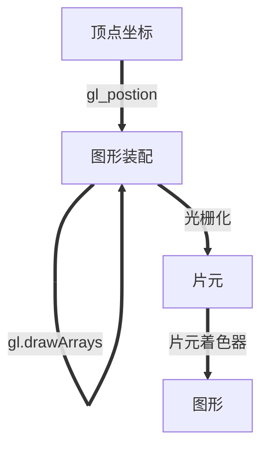
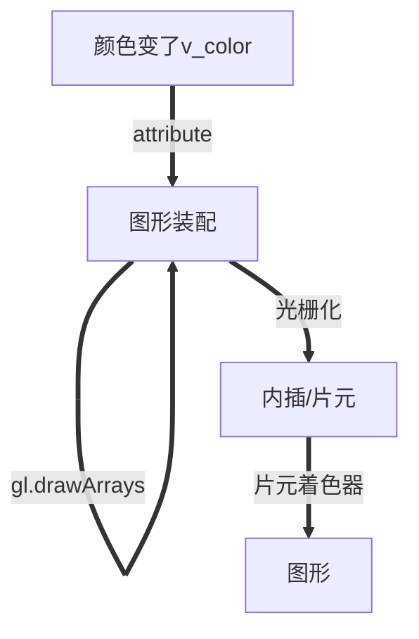

# 颜色与纹理

为顶点的每一个数据建立一个缓冲区，然后分配给对应的attribute变量，你可以向顶点着色器传递多份顶点数据。如：顶点尺寸，顶点坐标，顶点颜色，顶点纹理，法向量等。
其中使用多个缓冲区向着色器传递多种数据，比较适合数据里不大的情况。当程序有上万个顶点的时候显然不行。所以我们将顶点数据打包放到同一缓冲区里面，通过某种机制分别访问缓冲区对象中的不同种类数据。例如以**交错组织**的方式来放数据：

```js
var verticesSizes = new Float32Array([
    // 顶点坐标与点尺寸
    0.0, 0.5, 10.0, // 第一个点
    -0.5, -0.5, 20.0, // 第二个点
    0.5, -0.5, 30.0 // 第三个点
]) 
```

## WebGLRenderingContext.vertexAttribPointer()
将绑定到gl.ARRAY_BUFFE的缓冲区对象分配到由location指定的attribute变量
```js
/*
index 指定要修改的顶点属性的索引。

size 指定每个顶点属性的组成数量，必须是 1，2，3 或 4。

type 指定数组中每个元素的数据类型可能是：
    gl.BYTE: signed 8-bit integer, with values in [-128, 127] 有符号的 8 位整数，范围 [-128, 127]
    gl.SHORT: signed 16-bit integer, with values in [-32768, 32767] 有符号的 16 位整数，范围 [-32768, 32767]
    gl.UNSIGNED_BYTE: unsigned 8-bit integer, with values in [0, 255] 无符号的 8 位整数，范围 [0, 255]
    gl.UNSIGNED_SHORT: unsigned 16-bit integer, with values in [0, 65535] 无符号的 16 位整数，范围 [0, 65535]
    gl.FLOAT: 32-bit IEEE floating point number 32 位 IEEE 标准的浮点数
    When using a WebGL 2 context, the following values are available additionally: 使用 WebGL2 版本的还可以使用以下值：
    gl.HALF_FLOAT: 16-bit IEEE floating point number 16 位 IEEE 标准的浮点数

normalized 转换为浮点数时是否应该将整数数值归一化到特定的范围[0, 1] [-1, 1]。

stride 指定相邻两个顶点间的字节数，默认0

offset 指定缓冲区对象中的偏移量（以字节为单位），即attribute变量从缓冲区的何处开始存储。如果是从起始位置开始，参数设置为0

Return value
None.
*/
void gl.vertexAttribPointer(index, size, type, normalized, stride, offset);
```

## webgl执行流程



## 片元着色器内置变量

|类型与变量名|描述|
|---|---|
|vec4 gl_FragCoord|该内置变量的第一个和第二个分量表示片元在canvas坐标系统中的坐标值|

```js
precision mediump float;
uniform float u_Width;
uniform float u_Height;
void main() {
    // gl_FragCoord.x gl_FragCoord.y
    gl_FragColor = vec4(gl_FragCoord.x/u_Width, 0.0, gl_FragCoord.y/u_Height, 1.0);
}
```

**gl_FragCoord.x/u_Width**,**gl_FragCoord.y/u_Height**其中u_width以及u_Height通过uniform变量传入表示缓冲区的高度宽度，这样除以的原因是颜色分量的取值区间是**[0.0, 1.0]**

## varying变量

varying是WebGL中的一个关键字，用于在顶点着色器和片元着色器之间传递数据。在WebGL中，顶点着色器对每个顶点进行计算，并输出新的顶点位置、法向量等信息。然后，这些信息会传递给片元着色器，片元着色器使用这些信息对每个片元进行计算，并输出最终的颜色值。在顶点着色器和片元着色器之间传递数据的方式就是使用varying关键字声明变量。

例如，如果要在顶点着色器和片元着色器之间传递顶点的颜色信息，可以在顶点着色器中声明一个varying变量，然后在片元着色器中使用这个变量。具体的代码可以是这样的：

```js
// 顶点着色器
attribute vec3 position; // 顶点坐标
attribute vec3 color; // 顶点颜色

varying vec3 vColor; // 传递到片元着色器的变量

void main() {
  vColor = color; // 把顶点颜色传递给vColor变量
  gl_Position = vec4(position, 1.0); // 输出顶点位置
}

// 片元着色器
precision mediump float;

varying vec3 vColor; // 接收从顶点着色器传递过来的变量

void main() {
  gl_FragColor = vec4(vColor, 1.0); // 输出片元颜色
}
```
在上面这个例子中，声明**attribute vec3 color**来接收传入的数据，而**varying vec3 vColor**负责将颜色传给片元着色器。注意**varying**只能是**float vec2 vec3 vec4 mat2 mat3 mat4**类型。在片元着色器声明同样的**varying**变量即可。在webGL中如果顶点着色器与片元着色器有相同类型和命名相同的varying变量，那么顶点着色器复制给该变量的值会自动传入片元着色器。

### varying(变化的)变量的作用和内插过程

顶点着色器中的varying变量在传入片元着色器之前经过了内插过程。顶点着色器的varing变量v_color将值传递给片元着色器同名，同类型变量时的准确过程。



具体原理可以参照《计算机图形学》

## 纹理映射
将一个图像或者一个贴纸映射到一个几何图形的表面上，将一个真实的世界图形贴到一个或两个三角形组成的矩形上，这样矩形表面看上去就像这张图片。此时这张图又称为**纹理图像**或**纹理**。
纹理映射的作用根据纹理图像，为之前光栅化的每一个片元涂上合适的颜色组成纹理图像的像素（纹素），每一个纹素的颜色都使用RGB或RGBA格式编码。

具体步骤：
- 准备好映射到几何图形上的纹理图像
- 为几何图形配置纹理映射方式
- 加载纹理图形对其进行一些配置以在WEBGL中显示
- 在片元着色器中相应的纹素从纹理中抽取出来并将纹素的颜色赋值给片元

### 纹理坐标
纹理坐标在WebGL中又称为st坐标系统，常规的笛卡尔坐标系。纹理图像的四个角的坐标为左下角(0.0,0.0),右下角(1.0,0.0)右上角(1.0, 1.0)和左上角(0.0, 1.0)。纹理坐标很通用，因为坐标值与图像自身尺寸无关。

### WebGLRenderingContext.createTexture()
创建纹理对象以存储纹理图像

```js
// 返回值 一个可以被任何图像绑定的 WebGLTexture 目标
WebGLTexture gl.createTexture();
```

### WebGLRenderingContext.deleteTexture()
删除指定的WebGLTexture对象。如果纹理已被删除，则此方法无效。

```js
// texture将要删除的WebGLTexture 对象。
void gl.deleteTexture(texture);
```

### WebGLRenderingContext.pixelStorei(pname, param)
使用pname与param指定的方式处理加载得到的图像

```js
/**
参数
pname 
  gl.UNPACK_FLIP_Y_WEBGL 对图像进行y轴反转 默认值是false
  gl.UNPACK_PREMULTIPLY_ALPHA_WEBGL 将图像RGB颜色值的每一个分量乘以A 默认值false
param: 指定非0（true）或 0（false）必须为整数
 */
void gl.pixelStorei(pname, param);
```

### WebGLRenderingContext.activeTexture()
用来激活指定的纹理单元。

WebGL通过一种称作**纹理单元**的机制来同时使用多个纹理。每个纹理单元有一个单元编号来管理一张纹理图像。即使你的程序只需要使用一张纹理图像也得为其指定一个纹理单元。

```js
// texture 需要激活的纹理单元。其值是 gl.TEXTUREI ，其中的 I 在 0 到 gl.MAX_COMBINED_TEXTURE_IMAGE_UNITS - 1 范围内。
void gl.activeTexture(texture);

gl.activeTexture(gl.TEXTURE1);
// 纹理单元的数量视实现而定，你可以通过访问常量 MAX_COMBINED_TEXTURE_IMAGE_UNITS 来获取这个值。按照规范来说，最少是 8 个。
gl.getParameter(gl.MAX_COMBINED_TEXTURE_IMAGE_UNITS);
```

### WebGLRenderingContext.bindTexture()
开启texture指定纹理对象。并绑定到target上。此外，如果已经通过gl.activeTexture()激活了某个纹理单元，则纹理对象也会绑定到这个纹理单元上。该方法完成两个任务：开启纹理对象以及将纹理对象绑定到纹理单元上。在WebGL中你没法直接操作纹理对象，必须通过将纹理对象绑定到纹理单元上，然后通过操作纹理单元来操作纹理对象。

```js
/*

参数
target
GLenum (en-US) 指定绑定点（目标）。可能的值：

  gl.TEXTURE_2D: 二维纹理。
  gl.TEXTURE_CUBE_MAP: 立方体映射纹理。
  当使用 WebGL 2 context 时，可以使用以下值：
  gl.TEXTURE_3D: 三维纹理。
  gl.TEXTURE_2D_ARRAY: 二维数组纹理。
texture
要绑定的 WebGLTexture 对象。
*/
void gl.bindTexture(target, texture);
```

### WebGLRenderingContext.texParameter[fi]()
设置纹理参数，如何根据纹理坐标获取纹素颜色按照那种方式重复填充纹理。

TODO: https://developer.mozilla.org/zh-CN/docs/Web/API/WebGLRenderingContext/texParameter
```js
void gl.texParameterf(GLenum target, GLenum pname, GLfloat param);
void gl.texParameteri(GLenum target, GLenum pname, GLint param);
```

### WebGLRenderingContext.texImage2D() 将纹理图像分配给纹理对象
将纹理图像分配给纹理对象，同时该函数还允许告诉webGL关于该图像的一些特性

```js
/**
target gl.TEXTURE_2D gl.TEXTURE_CUBE_MAP
level 传入0实际上是为金字塔纹理准备
internalformat 图像内部格式
format 纹理数据格式必须和internalformat一样
type 纹理数据类型
image 包含纹理图像的Image对象
 */
gl.texImage2D(target, level, internalformat, format, type, image)
```

format参数表示纹理数据的格式，你必须根据纹理图像的格式来选择这个参数。具体取值如下：
|格式|描述｜图片格式|
|---|---|---|
|gl.RGB|红绿蓝|jpg|
|gl.RGBA|红绿蓝 透明度|png|
|gl.ALPHA|(0.0,0.0,0.0,透明度)||
|gl.LUMINANCE|L,L,L,1L：流明|灰度图像|
|gl.LUMINANCE_ALPHA|L,L,L：透明度|灰度图像|
流明：感知物体表面的亮度。通常使用物体表面红绿蓝颜色值的加权平均

type表示纹理数据的数据格式
|格式|描述|
|---|---|
|gl.UNSIGNED_BYTE|无符号整型 每一个颜色分量占据一个字节|
|gl.UNSIGNED_SHORT_5_6_5|RGB: 每一个分量占据5 6 5个比特|
|gl.UNSIGNED_SHORT_4_4_4_4|RGBA: 每个分量占据4 4 4 4比特|
|gl.UNSIGNED_SHORT_5_5_5_1|RGBA: RGB每个分量占据5比特 A分量占据1比特|

### 专用用于纹理的数据类型

|类型|描述|
|---|---|
|sampler2D|绑定到gl.TEXTURE_2D上的纹理数据|
|samplerCube|绑定到gl.TEXTURE_CUBE_MAP上的纹理数据类型|

### 抽取纹理颜色

GLSL ES内置函数texture2D()

从sampler指定的纹理上获取coord指定的纹理坐标处的像素颜色
```c
vec textture2D(smapler2D, smpler, vec2, vec2 coord)
```
